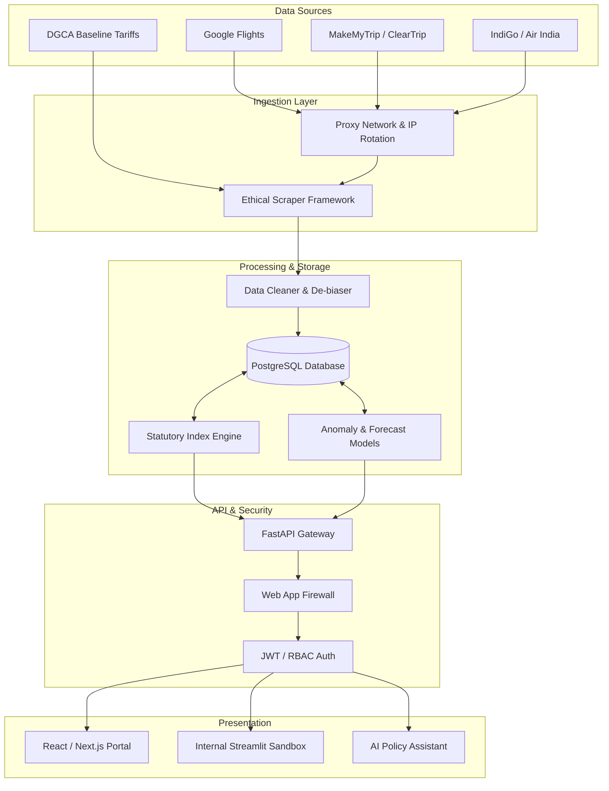

# VayuSutra: Final Project Presentation Content (SIH PS 26056)

*This document is structured as slide-by-slide content for your final SIH PowerPoint presentation. It outlines the complete, enterprise-grade final solution for the problem statement.*

---

## Slide 1: The Problem
**Title: The Airfare Inflation Measurement Gap**

*   **Manual & Outdated:** India's Ministry of Statistics and Programme Implementation (MoSPI) currently collects airfare data manually (via surveyors or basic checks). 
*   **Massive Time Lag:** The official Consumer Price Index (CPI) reporting has a 30-45 day lag. By the time inflation is reported, the market has completely shifted.
*   **Dynamic Pricing Ignored:** Airline prices change multiple times a day based on algorithmic yield management. Monthly spot-checks fail to capture this extreme volatility.
*   **Impact:** The Reserve Bank of India (RBI) and policymakers lack real-time data to make swift economic and monetary policy decisions regarding transport inflation.

---

## Slide 2: Our Solution
**Title: Automated High-Frequency Economic Intelligence Platform**

*   **Real-Time Data Ingestion:** An automated pipeline that ethically collects airfares across Google Flights, direct airline systems, and OTAs (Online Travel Agencies) multiple times a day.
*   **Statutory Index Engine:** Instantly computes official economic metrics (Jevons Elementary Mean, Laspeyres Index, and Fisher Ideal Index) to perfectly mirror official government standards.
*   **Automated De-biasing:** Cleanses the data by removing duplicates, applying tax decomposition, and utilizing robust statistical outlier detection (MAD Modified Z-Score) to ensure pure, unmanipulated data.
*   **Actionable Government Dashboard:** A centralized, role-based command center offering live airfare CPI, predictive forecasting, and anomaly alerts for policymakers.

---

## Slide 3: Innovation and Uniqueness
**Title: What Sets Us Apart**

*   **1. Data Trust Center & Cryptographic Provenance:** Government systems require absolute auditability. Every single scraped price receives a "Trust Score" (0-100) and a cryptographic hash (SHA-256) proving the data hasn't been tampered with.
*   **2. Zero-Hallucination AI Policy Analyst:** An integrated AI assistant (powered by RAG) that is strictly restricted to our database. It answers questions like *"Why did the index spike on Sept 20?"* using hard data, ensuring zero hallucinations.
*   **3. Policy "What-If" Simulator:** An interactive sandbox allowing the DGCA to simulate macroeconomic shocks: *"If Aviation Turbine Fuel (ATF) tax increases by 5%, what is the projected impact on next month's CPI?"*
*   **4. Predictive Inflation Nowcasting:** We don't just report the past; we use machine learning (Ensemble models, ETS, AR) to generate a 14-day forward forecast cone, providing an early warning system for central banks.

---

## Slide 4: Use of Technology (Tech Stack)
**Title: Enterprise-Grade Modern Tech Stack**

*   **Data Collection / Scraping Layer:** 
    *   `fast-flights` (Direct Protobuf decoding), `Playwright` (Headless browser), `curl_cffi` (Anti-bot circumvention).
    *   Enterprise Proxy Networks (BrightData/Oxylabs) for scalable OTA extraction.
*   **Backend & API Gateway:** 
    *   `FastAPI` (High-performance Python API), `Uvicorn`, `OAuth2` & JWT for secure government access.
*   **Data Processing & Machine Learning:** 
    *   `Pandas`, `NumPy` (Vectorized Math), `Scikit-Learn` (Isolation Forests / Z-Score anomaly detection).
*   **Database & Storage:** 
    *   `PostgreSQL` (Relational integrity) hosted on AWS RDS / Supabase with SQLAlchemy ORM.
*   **Frontend / Dashboard:** 
    *   **Government Portal**: `React.js` or `Next.js` with `Tailwind CSS` for a highly responsive, custom, and secure user interface.
    *   **Data Visualization**: `Recharts` or `Plotly.js` for complex interactive econometric charts and geospatial maps.
    *   **Internal Analyst Sandbox**: `Streamlit` (for data scientists to quickly test models before pushing to the main React dashboard).
*   **Cloud & CI/CD:** 
    *   `GitHub Actions` / AWS EC2 (Automated Cron daemon workers), Docker.

---

## Slide 5: Workflow of Project
**Title: End-to-End Intelligence Loop**

*   **1. INPUT (Data Acquisition):**
    *   Autonomous Daemon schedules scrapes at peak algorithm update hours (e.g., 7:00 PM).
    *   Requests pass through a Rate Limiter (Token Bucket) and IP Jitter module for ethical scraping of Airlines and OTAs.
*   **2. PROCESSING (The Engine):**
    *   *Verification & Cleaning:* Drop missing values, deduplicate multi-OTA listings, remove anomalous spikes.
    *   *Standardization:* Strip taxes and baggage fees to find the pure Base Fare.
    *   *Mathematical Engine:* Compute Laspeyres Index compared to a dynamic base period.
*   **3. OUTPUT (Distribution):**
    *   Data is pushed securely via the API Gateway.
    *   Government Dashboard visualizes live CPI, Heatmaps, and AI Explanations.
    *   Automated PDF/CSV Intelligence Dossiers are generated for NSO/MoSPI records.

---

## Slide 6: Secure Acquisition Engine (Ethical Data Collection)
**Title: Bulletproof & Government-Compliant Ingestion**

*   **Browser Escalation Architecture:** 
    *   We start lightweight (Fast HTTP Protobuf requests). If a site blocks us or requires JavaScript execution, the system dynamically escalates to full browser-based collection (`Playwright` / `Selenium`).
*   **IP Rotation & Session Control:** 
    *   To prevent anti-bot bans, we utilize Enterprise Proxy Networks. Importantly, we practice **Controlled Observation**—maintaining consistent session cookies, locations, and user-agents for a single booking query so the airline doesn't show manipulated prices.
*   **Polite Backoff & Token Bucket:** 
    *   We adhere strictly to `robots.txt`. If a source is overloaded, we don't hammer it. We use exponential polite backoff (e.g., waiting 2s -> 4s -> 8s) to respect the host servers.
*   **Automated Source Fallback:** 
    *   If Source A (e.g., Google Flights) is down or rate-limited, the system seamlessly falls back to Source B (Airline Direct API), and then Source C (OTA). The pipeline never breaks.

---

## Slide 7: System Architecture
**Title: Secure, Scalable, and Cloud-Native**

*(Note for presentation: You can recreate this flowchart using PowerPoint shapes for a cleaner presentation look, or embed this directly if your software supports Mermaid).*

---

## Slide 7: Security & Governance
**Title: Enterprise-Grade Data Protection**

*   **API Security & WAF:** All requests pass through a Web Application Firewall (WAF) to prevent DDoS and SQL injections. The FastAPI backend is secured via **OAuth2** and **JWT (JSON Web Tokens)**.
*   **Role-Based Access Control (RBAC):** Strict permission levels (Admin, Analyst, Viewer) ensure that, for instance, a data clerk cannot access the central bank forecasting models or alter the data.
*   **Cryptographic Data Provenance:** Every single scraped price receives a SHA-256 hash at the moment of collection. If any value in the database is manually altered, the hash breaks, ensuring absolute auditability for government regulators.
*   **AI Security & RAG Validation:** The AI Policy Analyst is strictly sandboxed. It undergoes Prompt Injection checks and Output Validation to ensure it never reveals confidential data or hallucinates outside the provided economic datasets.
*   **Secrets Management:** 100% of API keys and database credentials are kept out of source code, secured via cloud vaults (GitHub Secrets / AWS Secrets Manager).

---

## Slide 8: Feasibility and Viability
**Title: Ready for Government Production**

*   **Technical Feasibility:** 
    *   Built entirely on proven, open-source Python frameworks. The architecture separates the highly-volatile scraping layer from the secure mathematical backend, meaning if a scraper breaks, the dashboard and historical data remain unaffected.
*   **Economic Viability:** 
    *   Extremely cost-effective. By intercepting binary protocols (e.g., Google Flights protobufs) rather than opening heavy web browsers for every request, compute costs are slashed by over 90%. Cloud-native serverless hosting ensures we only pay for exactly what we process.
*   **Operational Viability for Government:** 
    *   **Security First:** Role-Based Access Control (RBAC) ensures a data entry clerk cannot access the RBI forecasting module.
    *   **Compliance:** Built-in audit trails and provenance hashes ensure every piece of data is traceable, answering the strict audit requirements of government statistical departments.

---

## Slide 9: Tools & Technology Landscape
**Title: Tech Stack Evolution: From Prototype to Final Production**

To demonstrate our engineering maturity, here is a breakdown of how our technology stack has evolved from initial prototypes to the final proposed architecture.

### 1. Initial SIH Prototype Tools (Our Foundation)
*   **Scraping:** `fast-flights` (for Google Flights).
*   **Data Processing & Indexing:** `Pandas` (for Laspeyres CPI), `scikit-learn` (Z-Score/Isolation Forest for anomalies).
*   **Database:** `Supabase` (PostgreSQL) with connection pooling.
*   **Automation:** `GitHub Actions` (free cloud cron) and local Python scheduler.
*   **Frontend:** `Streamlit` and `Plotly` (interactive maps).

### 2. VayuSutra Tools (The Enterprise Architecture)
*   **Backend & API:** `FastAPI`, `Uvicorn`, `OAuth2` & JWT.
*   **Data Validation:** `Pydantic`.
*   **Mathematical Engine:** Advanced custom econometric models (Fisher Ideal, Jevons Mean).
*   **AI Integration:** LLM RAG pipelines for the AI Policy Analyst.

### 3. New Prototype Tools (What we are building right now)
*   **Acquisition Engine:** `fast-flights` + `curl_cffi` (for anti-bot evasion).
*   **Backend:** `FastAPI` (combining VayuSutra's backend with the prototype's scraping).
*   **Database:** `Supabase` (Free tier).
*   **Frontend:** `React.js` + `Tailwind CSS` for the main portal; `Streamlit` kept for internal analyst testing.
*   **Automation:** `GitHub Actions`.

### 4. Final Government Project Tools (Production Stack)
If deployed nationally by MoSPI, we recommend a mix of enterprise and open-source tools to balance reliability with cost:

**Paid / Enterprise Options (Maximum Reliability):**
*   **Enterprise Scraping:** `BrightData` or `Oxylabs` (for massive IP rotation and avoiding OTA bans).
*   **Cloud Infrastructure:** `AWS EC2` (dedicated cron workers to avoid free-tier queue delays) and `AWS RDS` (Managed PostgreSQL).
*   **Web Application Firewall:** `Cloudflare WAF` or `AWS WAF` for DDoS protection.
*   **AI Models:** `OpenAI API (GPT-4o)` or `c:\Users\srajan shetty\AppData\Local\Packages\5319275A.WhatsAppDesktop_cv1g1gvanyjgm\LocalState\sessions\15D90C184902CDE744E3E3169747BBC907A3020A\transfers\2026-38\Airfare_System_Workflow.pdfAnthropic Claude 3.5` for the zero-hallucination policy analyst.

**Free / Open-Source Alternatives (Maximum Privacy & Cost Efficiency):**
*   **In-House Scraping:** Self-hosted proxy management using `Scrapoxy` or Tor-network rotation.
*   **Infrastructure (On-Premise):** Deploying the entire stack on internal government servers using `Docker Swarm` or lightweight Kubernetes (`K3s`) at zero cloud cost.
*   **Web Application Firewall:** `ModSecurity` (Open-source WAF) integrated with NGINX.
*   **AI Models (On-Premise):** Running open-source LLMs like `Llama 3` or `Mistral` locally using `Ollama`. This ensures highly sensitive government data never leaves the internal servers!
